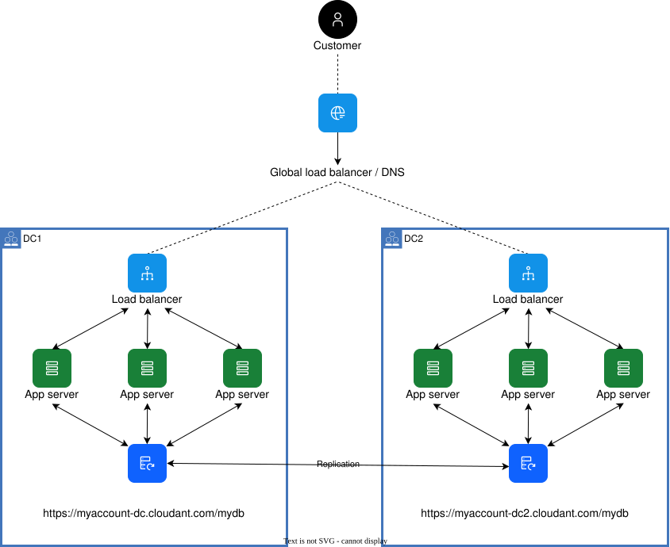

---

copyright:
  years: 2017, 2026
lastupdated: "2026-06-09"

keywords: create database, create api key for replication, grant access permission, set up replications, test replication, configure application, active-active configuration, active-passive configuration, failover, recovering from failover

subcollection: cloudant-gen2

---

{{site.data.keyword.attribute-definition-list}}

# Configuring {{site.data.keyword.cloudant_short_notm}} for cross-region disaster recovery
{: #configuring-ibm-cloudant-for-cross-region-disaster-recovery}

The [{{site.data.keyword.cloudant_short_notm}} disaster recovery guide](/docs/cloudant-gen2?topic=cloudant-gen2-disaster-recovery-and-backup#disaster-recovery-and-backup)
explains that one way to enable disaster recovery is to use
{{site.data.keyword.cloudant_short_notm}} replication to create redundancy across regions.
{: shortdesc}

For more information, see how to [retrieve replication scheduler documents](/apidocs/cloudant#getschedulerdocs) and monitor replication status.

You can configure replication in {{site.data.keyword.cloudantfull}} by using an "active-active"
or "active-passive" topology across regions.

The following diagram shows a typical configuration that
uses two {{site.data.keyword.cloudant_short_notm}} accounts,
one in each region:

{: caption="Example active-active architecture" caption-side="bottom"}

Remember these important facts:

- Within each region, {{site.data.keyword.cloudant_short_notm}} already offers high availability by storing data in triplicate across three availability zones.
- Replication occurs at the database rather than account level and must be explicitly configured.
- {{site.data.keyword.cloudant_short_notm}} doesn't provide any Service Level Agreements (SLAs) or certainties about replication latency. {{site.data.keyword.cloudant_short_notm}} doesn't monitor individual replications. Your own strategy for detecting failed replications and restarting them is advisable.

## Before you begin an active-active deployment
{: #before-you-begin-an-active-active-deployment}

For an active-active deployment, a strategy for managing conflicts must be in place, so be sure to understand how [replication](/docs/cloudant-gen2?topic=cloudant-gen2-replication-api#replication-api) and [conflicts](/docs/cloudant-gen2?topic=cloudant-gen2-document-versioning-and-mvcc#document-versioning-and-mvcc) work before you consider this architecture.
{: note}

Go to the [{{site.data.keyword.cloud_notm}} Support portal](https://www.ibm.com/cloud/support) if you need help with how to model data to handle conflicts effectively.

## Overview
{: #overview-active-active}

In the following material,
a bidirectional replication is created.
This configuration allows two databases to work in an active-active topology.

The configuration assumes that you have two accounts in different regions:

- `00000000-0000-0000-0000-00000000.abc.cloudant.eu-de.dataservices.appdomain.cloud`
- `11111111-1111-1111-1111-11111111.abc.cloudant.us-east.dataservices.appdomain.cloud`

After these accounts are created, complete these steps:

1. [Create](#step-1-create-your-databases) a pair of peer databases within the accounts.
2. [Set up](#step-2-create-an-api-key-for-your-replications) API keys to use for the replications between these databases.
3. Set up replications.
4. Test replications are working as expected.
5. Configure application and infrastructure for either active-active or active-passive use of the databases.
6. Monitor the replication.

## Step 1. Create your databases
{: #step-1-create-your-databases}

[Create the databases](/apidocs/cloudant#putdatabase){: external} that you want to replicate between
within each account. For the purposes of this example, we'll assume that there's a database called `mydb` in each account.

## Step 2. Create an IAM API key for each {{site.data.keyword.cloudant_short_notm}} instance
{: #step-2-create-an-api-key-for-your-replications}

Complete the instructions in [Locating your credentials](/docs/cloudant-gen2?topic=cloudant-gen2-locating-your-service-credentials) to create an IAM API key for each {{site.data.keyword.cloudant_short_notm}} instance.

## Step 3. Set up replications
{: #step-3-set-up-replications}

Replications in {{site.data.keyword.cloudant_short_notm}} are always uni-directional: from the source database to the target database. To replicate both ways between two databases, two replications are required, one for each direction.

Use [the Dashboard](/docs/cloudant-gen2?topic=cloudant-gen2-navigate-the-dashboard) to create the `_replicator` database in each Cloudant instance - this is where the replication documents will be stored.

Next, create a replication document in each instance's `_replicator` database. The first copies `mydb` from the Frankfurt instance to the Washington instance. Create a replication document in the `_replicator` database of the US East instance:

```json
{
  "_id": "mydb-replication-us-east-to-us-east",
  "source" : {
    "url": "https://00000000-0000-0000-0000-00000000.abc.cloudant.eu-de.dataservices.appdomain.cloud/mydb",
		"auth": {
			"iam": {
				"apikey":	"<myapikey1>"
			}
		}
	},
  "target" : {
		"url": "https://11111111-1111-1111-1111-11111111.abc.cloudant.us-east.dataservices.appdomain.cloud/mydb",
		"auth": {
			"iam": {
			  "apikey":	"<myapikey2>"
			}
		}
	},
	"continuous": true
}
```
{: codeblock}

The above replication documents use the API keys created earlier in [Step 2](#step-2-create-an-api-key-for-each-cloudant-instance).
{: note}

The create a replication document in the `_replicator` database of the Washington instance:

```json
{
  "_id": "mydb-replication-us-east-to-us-east",
  "source" : {
		"url": "https://11111111-1111-1111-1111-11111111.abc.cloudant.us-east.dataservices.appdomain.cloud/mydb",
		"auth": {
			"iam": {
			  "apikey":	"<myapikey2>"
			}
		}
	},
	"target" : {
    "url": "https://00000000-0000-0000-0000-00000000.abc.cloudant.eu-de.dataservices.appdomain.cloud/mydb",
		"auth": {
			"iam": {
				"apikey":	"<myapikey1>"
			}
		}
	},
	"continuous": true
}
```
{: codeblock}


## Step 4. Test your replication
{: #step-4-test-your-replication}

Test the replication processes by creating,
modifying, and deleting documents in either database.

After each change in the database, check that you can also see that change in the other database.

## Step 5. Configure your application
{: #step-5-configure-your-application}

The databases are set up to remain synchronized with each other.

The next decision is whether to use the databases in an
[active-active](#active-active) or [active-passive](#active-passive) manner.

### Active-active
{: #active-active}

In an active-active configuration, both Cloudant instances accept application API traffic at the same time.

For example,
application "A" might write to database `https://00000000-0000-0000-0000-00000000.abc.cloudant.eu-de.dataservices.appdomain.cloud/mydb`,
while application "B" might write to database `https://11111111-1111-1111-1111-11111111.abc.cloudant.us-east.dataservices.appdomain.cloud/mydb`.

This configuration offers several benefits:

- Load can be spread over several accounts.
- You can configure applications to access an account with reduced latency (not always the geographically closest).

An application can be set up to communicate with the "nearest"
{{site.data.keyword.cloudant_short_notm}} account.
For applications hosted in Europe,
it's appropriate to set their {{site.data.keyword.cloudant_short_notm}}
URL to `"https://00000000-0000-0000-0000-00000000.abc.cloudant.eu-de.dataservices.appdomain.cloud/mydb"`.
Similarly, for applications that are hosted in India,
set their {{site.data.keyword.cloudant_short_notm}} URL to `"https://11111111-1111-1111-1111-11111111.abc.cloudant.us-east.dataservices.appdomain.cloud/mydb"`.

### Active-passive
{: #active-passive}

In an active-passive configuration,
all API traffic is configured to use a nominated primary database.
However, the application can fail over to the other secondary database, if circumstances make it necessary.
The failover might be implemented within the application logic itself, or by using a load balancer, or by using some other means.

A simple test of whether a failover is required is to
use the main database endpoint as a "heartbeat".
For example, a simple `GET` request that is sent to the main database endpoint normally returns
[details about the database](/apidocs/cloudant#getdatabaseinformation){: external}.
If no response is received, it might indicate that a failover is necessary.

### Other configurations
{: #other-configurations}

You might consider other hybrid approaches for your configuration.

For example, in a "Write-Primary, Read-Replica" configuration, all writes go to one database, but the read load is distributed among the replicas.

## Step 6. Monitoring
{: #step-6-monitoring}

- Consider monitoring the [replications](/docs/cloudant-gen2?topic=cloudant-gen2-advanced-replication#advanced-replication) between the databases.
    Use the data to determine whether your configuration might be optimized further.
-	Consider how your design documents and indexes are deployed and updated.
    You might find it more efficient to automate these tasks.

### Failing over between {{site.data.keyword.cloudant_short_notm}} regions
{: #failing-over-between-ibm-cloudant-regions}

Typically, the process of managing a failover between regions or datacenters is handled higher up within your application stack,
for example by configuring application server failover changes,
or by balancing the load.

{{site.data.keyword.cloudant_short_notm}} doesn't provide a facility for you
to manage explicitly any failover or reroute requests between regions.
This constraint is partly for technical reasons,
and partly because the conditions under when it might happen tend to be application-specific.
For example,
you might want to force a failover in response to a custom performance metric.

However,
if you decide that you need the ability to manage failover,
consider the following possible options:

- Put your own [HTTP proxy in front of {{site.data.keyword.cloudant_short_notm}}](https://github.com/greenmangaming/cloudant-nginx){: external}. Configure your application to talk to the proxy rather than the {{site.data.keyword.cloudant_short_notm}} instance. This configuration means that the task of changing the {{site.data.keyword.cloudant_short_notm}} instances that are used by applications can be handled through a modification to the proxy configuration rather than a modification to the application settings. Many proxies can balance the load, based on user-defined health checks.
- Use a global load balancer such as [{{site.data.keyword.cloud}} Internet Services](/docs/cis?topic=cis-global-load-balancer-glb-concepts#global-load-balancer-glb-concepts){: external} to route to {{site.data.keyword.cloudant_short_notm}}. This option requires a `CNAME` definition that routes to different {{site.data.keyword.cloudant_short_notm}} accounts, based on a health check or latency rule.


### Recovering from failover
{: #recovering-from-failover}

If a single {{site.data.keyword.cloudant_short_notm}} instance is unreachable,
avoid redirecting traffic back to it as soon as it becomes reachable again.
The reason is that some time is required for intensive tasks
such as synchronizing the database state from any peers,
and ensuring that indexes are up to date.

It's helpful to have a mechanism for monitoring these tasks
to help decide when a database is in a suitable state to service your production traffic.

As a guide,
a typical list of checks to apply include:

- [Replications](#replications)
- [Indexes](#indexes)

If you implement rerouting for requests or failover based on a health test, you might want to incorporate corresponding checks to avoid premature rerouting back to a service instance that is still recovering.
{: note}

#### Replications
{: #replications}

- Are any replications in an error state?
- Do any replications need restarting?
- How many pending changes are still waiting for replication into the database?

For more information, see how to [retrieve replication scheduler documents](/apidocs/cloudant#getschedulerdocs){: external} and monitor replication status.

If a database is being changed continuously, the replication status is unlikely to be zero. You must decide what status threshold is acceptable, or what represents an error state.
{: note}

#### Indexes
{: #indexes}

- Are the indexes sufficiently up to date?
   Verify that indexes are updated by using the [active tasks](/docs/cloudant-gen2?topic=cloudant-gen2-active-tasks#active-tasks) endpoint.
- Test the level of "index readiness" by sending a query to the index,
   and deciding whether it returns within an acceptable time.
