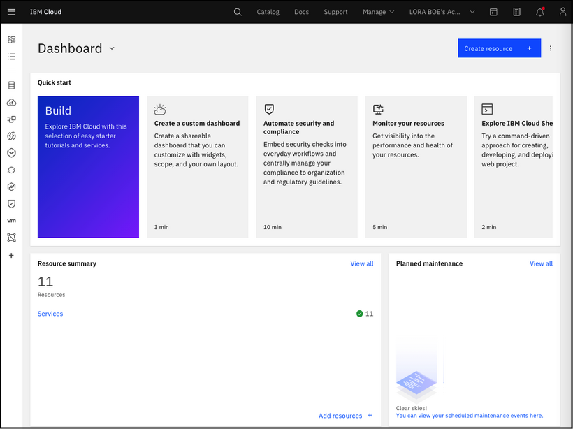
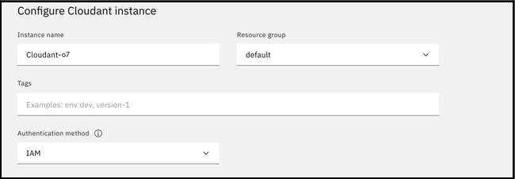

---

copyright:
  years: 2015, 2023, 2026
lastupdated: "2026-06-01"

keywords: example, connect to service instance, create service instance, service credentials, instance, IBM Cloudant, cloudant

subcollection: cloudant-gen2

content-type: tutorial
services: Cloudant
account-plan: standard
completion-time: 20m

---

{{site.data.keyword.attribute-definition-list}}

# Getting started with {{site.data.keyword.cloudant_short_notm}}
{: #getting-started-with-cloudant}
{: toc-content-type="tutorial"}
{: toc-services="Cloudant"}
{: toc-completion-time="20m"}

The {{site.data.keyword.cloudantfull}} *Getting started* tutorial demonstrates how to use the {{site.data.keyword.cloud}} dashboard to create an {{site.data.keyword.cloudant_short_notm}} service instance and obtain service credentials to connect to it. Finally, you will use the {{site.data.keyword.cloudant_short_notm}} database using the Dashboard.

{: shortdesc}

If you'd prefer to create a {{site.data.keyword.cloudant_short_notm}} instance using the command line, see the [Creating a service instance using the IBM Cloud CLI](/docs/cloudant-gen2?topic=cloudant-gen2-creating-an-ibm-cloudant-instance-on-ibm-cloud-by-using-the-ibm-cloud-cli) tutorial.
{: tip}

## Objectives
{: #objectives-get-started}

- Create a service instance.
- Create an {{site.data.keyword.cloudant_short_notm}} service credential.
- Create databases and JSON documents using the {{site.data.keyword.cloudant_short_notm}} Dashboard.

## Creating a service instance
{: #creating-an-ibm-cloudant-instance-on-ibm-cloud}
{: step}

1.  Log in to your {{site.data.keyword.cloud_notm}} account, and click `Create resource`.

    {: caption="{{site.data.keyword.cloud_notm}} Dashboard" caption-side="bottom"}

    The {{site.data.keyword.cloud_notm}} Dashboard can be found at:
    [https://cloud.ibm.com/](https://cloud.ibm.com/){: external}.
    After you authenticate with your username and password,
    you're presented with the {{site.data.keyword.cloud_notm}} Dashboard.
    {: note}

2.  Type `Cloudant` in the Search bar and click to open it.

3.  Select an offering and an environment.

4.  Type an instance name.

    {: caption="{{site.data.keyword.cloudant_short_notm}} service name and credentials" caption-side="bottom"}

    (In this example, the instance name is `Cloudant-o7`.) Verify that the resource group is correct. Add a tag if you like. 

5.  To create the service, click `Create`:

    After you click `Create`, the system displays a message to say that the instance is being provisioned, which returns you to the Resource list. From the Resource list, you see that the status for your instance is, `Provision in progress`.

6.  After you create an instance, the status changes to `Active`.

7.  Click the instance, and proceed to the next section, [Creating service credentials](#creating-service-credentials).

## Creating service credentials
{: #creating-service-credentials}
{: step}

For more information about where to find your credentials, see [Locating your credentials](/docs/cloudant-gen2?topic=cloudant-gen2-locating-your-service-credentials).

## Using your {{site.data.keyword.cloudant_short_notm}} service with the Dashboard
{: #using-your-cloudant-service-with-the-dashboard}
{: step}

Use the {{site.data.keyword.cloudant_short_notm}} Dashboard to manage your {{site.data.keyword.cloudant_short_notm}} service. For more information, see [Using the {{site.data.keyword.cloudant_short_notm}} Dashboard](/docs/cloudant-gen2?topic=cloudant-gen2-navigate-the-dashboard).
