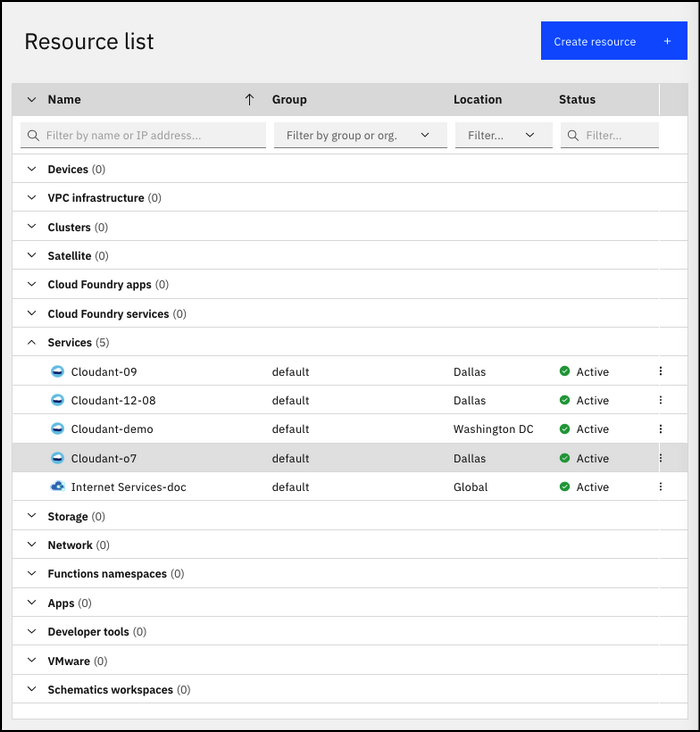
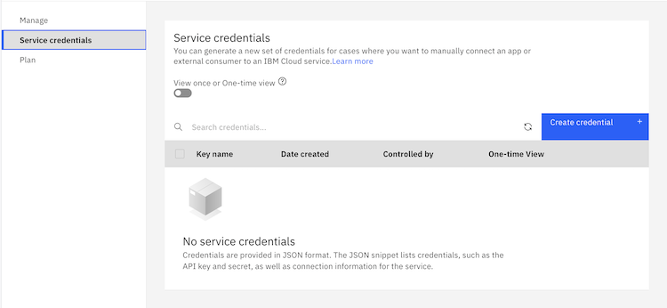
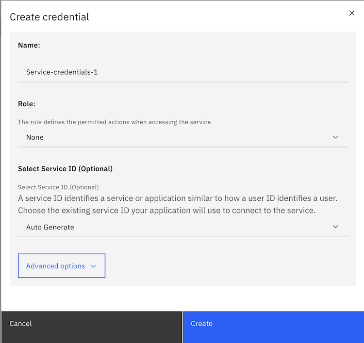
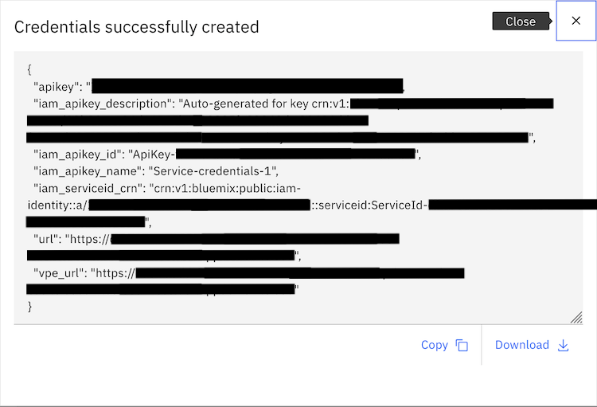

---

copyright:
  years: 2020, 2026
lastupdated: "2026-06-05"

keywords: service credentials, locate service credentials

subcollection: cloudant-gen2

content-type: tutorial
services: Cloudant
account-plan: lite
completion-time: 5m

---

{{site.data.keyword.attribute-definition-list}}

# Locating your service credentials
{: #locating-your-service-credentials}
{: toc-content-type="tutorial"}
{: toc-services="Cloudant"}
{: toc-completion-time="5m"}

You can find the credentials for any service that is associated with your account.
{: shortdesc}

## Objectives
{: #objectives-locate-credentials}

1. Locate your service credentials in {{site.data.keyword.cloud_notm}}.
2. Understand your service credentials.

## Before you begin
{: #prereq-locate-credentials}

Create a service instance in the {{site.data.keyword.cloud_notm}} Dashboard by following the [Getting started with {{site.data.keyword.cloudant_short_notm}}](/docs/cloudant-gen2?topic=cloudant-gen2-getting-started-with-cloudant) tutorial.

## How to find your service credentials
{: #finding-your-service-credentials}
{: step}

1. Go to [{{site.data.keyword.cloud_notm}}](https://cloud.ibm.com/) and log in.

2. Find the service instance called `Cloudant-o7` and open it.

   This instance is the one you created as in the [Before you begin](#prereqs-locate-credentials) section.

    {: caption="Selecting the {{site.data.keyword.cloudant_short_notm}} service" caption-side="bottom"}

3. Click **Service credentials**. If you have no pre-existing service credentials, the list will be empty:
    {: caption="Service Credentials list before any are created" caption-side="bottom"}

4. Click **Create credential** to create a new set of service credentials:
    {: caption="The form to be completed to create a new service credential" caption-side="bottom"}

5. Choose a name for your credential, choose a role from the pull-down list (e.g. `Manager`) and click **Create**.

    {: caption="Service credentials are displayed and ready to copy" caption-side="bottom"}

6. Make a note of the service credentials immediately as they will not be displayed again.

## Understanding your service credentials
{: #the-service-credentials}
{: step}

Service credentials are valuable. If anyone or any application has access to the credentials, they can effectively do whatever they want with the service instance. For example, they might create spurious data, or delete valuable information. Protect these credentials carefully.

The service credentials include the following fields:

| Field | Purpose |
|------|---------|
| `api_key` | The IBM IAM API key. This key is exchanged for time-limited access token. The token is used to authenticated API requests. |
| `iam_apikey_description` | Description of the IAM API key. |
| `iam_apikey_id` | The unique ID of the IAM API key. |
| `iam_apikey_name` | The name of the IAM API key, as chosen in the form above. |
| `iam_serviceid_crn` | The CRN of the service ID that the IAM API key is associated with. |
| `url` | The HTTPS URL to access the {{site.data.keyword.cloudant_short_notm}} instance on the public network. |
| `vpe_url`| The HTTP URL to access the {{site.data.keyword.cloudant_short_notm}} instance on the private network. |
{: caption="Service credential fields" caption-side="top"} 
