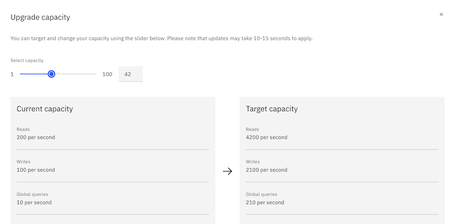

---

copyright:
  years: 2015, 2026
lastupdated: "2026-06-08"

keywords: database-as-a-service,json document store, lite plan, standard plan, enterprise plan, benefits of lite and standard plans

subcollection: cloudant-gen2

---

{{site.data.keyword.attribute-definition-list}}

# Migration overview
{: #migrating-to-ibm-cloudant-on-ibm-cloud}

The [{{site.data.keyword.cloudantfull}}](https://www.ibm.com/products/cloudant){: external} database-as-a-service offering is a JSON document store that runs on multi-tenant clusters. The service is available with a choice of geographical locations with predictable costs, scalability, and a service-level agreement (SLA).
{: shortdesc}

You can migrate to an {{site.data.keyword.cloudant_short_notm}} Standard plan instance on {{site.data.keyword.cloud_notm}} from one of the following plans:

| Plan | Description |
|-----|------------|
| Apache CouchDB | The self-hosted, open source database on which {{site.data.keyword.cloudant_short_notm}} is based. |
{: caption="{{site.data.keyword.cloudant_short_notm}} migration paths" caption-side="top"}

## Benefits of the {{site.data.keyword.cloudant_short_notm}} Standard plan
{: #what-are-the-benefits-of-the-ibm-cloudant-lite-and-standard-plans-}

With the Standard plan, you can *reserve throughput capacity* for your database service, that is, to specify how much throughput your application's database is going to need to handle demand. The Standard plan also charges for the amount of storage you use. Capacity is measured with the following metrics:

| Metric | Description |
|-------|------------|
| Reads per second | The rate when simple document fetches are performed, for example, retrieving a document by its `_id`, or querying against a partitioned database that uses a partition key. |
| Writes per second | The rate when data is written to the database. API calls dealing with document creation, update, or deletion count as "writes".
| Global Queries per second |The rate when the database is queried by global indices, typically by accessing the `_find` endpoint, secondary MapReduce, or search indices. |
| Storage | The amount of disk space occupied by your JSON data, attachments, and secondary indices. |
{: caption="Capacity metrics" caption-side="top"}

 The Standard plan's smallest capacity has 100 reads per second, 50 writes per second, 5 global queries per second, and 20 GB of storage. You can buy extra storage, which is charged monthly by the GB.

By using the slider in the {{site.data.keyword.cloudant_short_notm}} Dashboard, you can reserve a smaller or larger capacity for your {{site.data.keyword.cloudant_short_notm}} service whenever you need it:

{: caption="Slider" caption-side="bottom"}

You're billed on the highest capacity that is selected in any given hourly window. Your database throughput can scale up to deal with seasonal demands and scale down again for the quiet times. Your monthly bill is always predictable; upgrades are automatic; and your SLA is [99.99%](https://www.ibm.com/support/customer/csol/terms?id=i126-6627&lc=en#detail-document){: external}.

If you exceed your quota of reads, writes, and global queries in a given second, the {{site.data.keyword.cloudant_short_notm}} API responds with a `429: too many requests` HTTP response. Your application might retry the request later. You can use our official libraries to retry such requests with an exponential back off, but a sustained excessive API load will still result in a `429` response.
